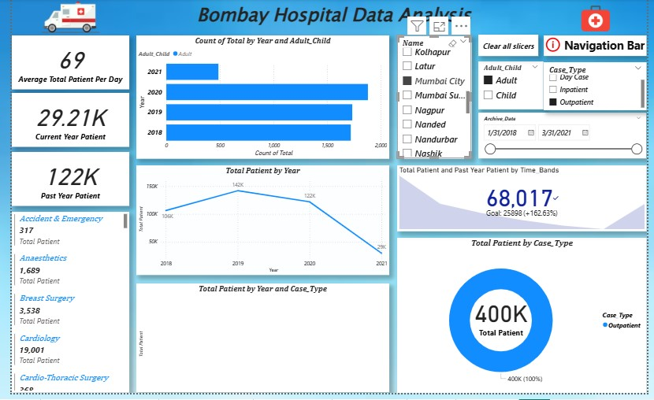

🏥 Bombay Hospital Dashboard Analysis (Power BI Project)
📖 Project Overview

This project presents an interactive Hospital Performance Dashboard developed using Power BI.
The objective of this analysis is to convert raw hospital operational data into meaningful insights that support better decision-making for hospital management.

The dashboard helps administrators monitor patient flow, departmental workload, doctor utilization, and overall hospital performance in a simple visual format.

🎯 Business Objective

Hospitals handle large amounts of patient and operational data daily. Without proper analysis, management cannot efficiently allocate staff, plan resources, or identify performance gaps.

This project answers key business questions:

Which department receives the highest number of patients?

What are peak admission periods?

Which doctors handle the most cases?

How is hospital workload distributed?

How can management improve operational efficiency?

🛠 Tools & Technologies Used

Power BI Desktop

Power Query (Data Cleaning & Transformation)

DAX (KPIs & Measures)

Excel Dataset

📊 Dashboard Features

Patient admission analysis

Department-wise performance tracking

Doctor workload distribution

KPI indicators

Interactive filters & slicers

Dynamic visual reports

📷 Dashboard Preview
Full Dashboard :-

Department Analysis :-

Tree Map / Patient Distribution :-

Table View:-

Filters & Interactivity:-

📈 Key Insights

Identified high-load hospital departments

Recognized peak patient admission times

Analyzed doctor case handling distribution

Observed treatment demand patterns

Supported better hospital resource planning

📂 Dataset Description

The dataset contains simulated hospital operational records including:

Patient ID

Department

Doctor Name

Admission Details

Treatment Type

Billing Data

This dataset is used strictly for educational and portfolio purposes.

🚀 How to Use

Download the .pbix file from this repository

Open using Microsoft Power BI Desktop

Interact with filters and visuals

💡 Skills Demonstrated

Data Cleaning

Data Visualization

Dashboard Design

Business Insight Extraction

KPI Creation using DAX

👨‍💻 Author

Rupesh Desai
Aspiring Data Analyst

Skills: SQL | Power BI | Excel | Python | Data Analysis

📧 Email: rupeshdesaiwork@gmail.com

🔗 LinkedIn: https://www.linkedin.com/in/rupeshdesai2010/
